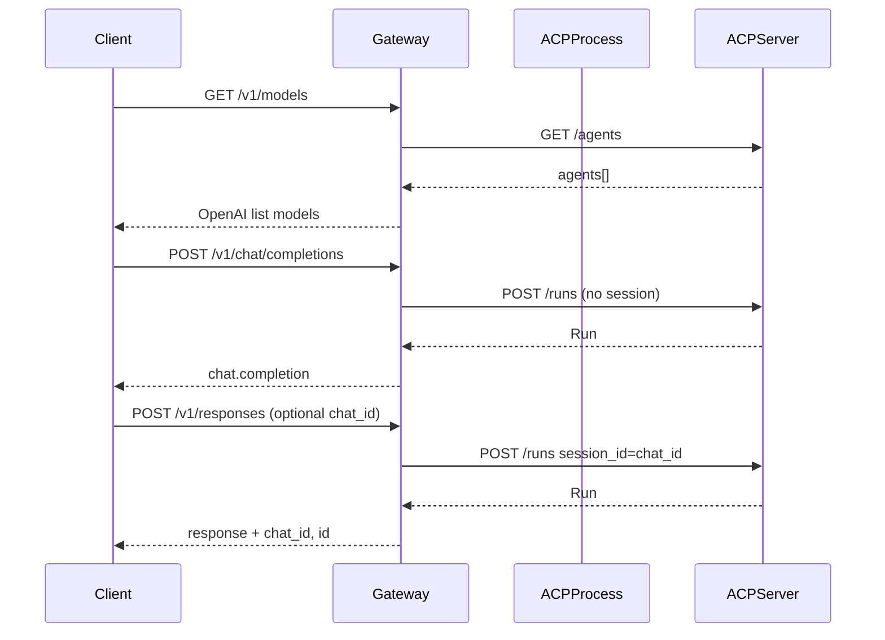

# ACP OpenAI API Gateway

OpenAI-compatible HTTP API that runs an ACP (Agent Communication Protocol) server and translates requests and responses. Clients use the usual OpenAI endpoints (`/v1/models`, `/v1/chat/completions`, `/v1/responses`) while the gateway talks to any ACP-compatible backend.

## Problem

Many tools and SDKs (IDEs, scripts, OpenAI client libraries) expect an OpenAI-style API. Agents are often implemented as ACP servers with a different request/response format. This gateway provides a single entry point: one base URL, OpenAI-shaped API, with an ACP server running behind it.

## How it works

1. **Config** – The gateway reads a YAML config (and env) to know which ACP server to start and how (command, env vars, base URL).
2. **Process** – On startup it runs the ACP server as a subprocess, waits for `GET {gateway.acp_base_url}/ping` to succeed, then accepts HTTP traffic.
3. **Translation** – Incoming OpenAI-style requests are converted to ACP calls and responses are converted back:
   - `GET /v1/models` -> `GET /agents` (agents become "models").
   - `POST /v1/chat/completions` -> `POST /runs` without session (stateless).
   - `POST /v1/responses` -> `POST /runs` with `session_id` (stateful); optional `chat_id` in body for session continuity; response includes `chat_id` and `id` (response_id).
4. **Shutdown** – On exit the gateway stops the ACP process (SIGTERM / SIGKILL).



## Quick setup

1. **Config** – Copy `config.example.yaml` to `config.yaml` and adjust. Every option can also be set via environment (see `.env.example`).

2. **Env** – Copy `.env.example` to `.env` and set values. All options (`CONFIG_PATH`, `ACP_*`, `GATEWAY_*`) can be configured via env.

3. **Run** – From the repo root:

```bash
pip install -r requirements.txt
CONFIG_PATH=config.yaml python -m gateway.main
```

Or with Docker Compose (reads `.env` and runs the `gateway` service):

```bash
cp .env.example .env
docker compose up --build gateway
```

4. **Use** – Point any OpenAI client at `http://localhost:8080/v1` (or your host/port). List models, call chat completions or responses; the gateway translates to ACP and back.

## Tests

Tests do not start an ACP process: the gateway calls a mock ACP over HTTP (`httpx.MockTransport`). Route tests live in `tests/test_models.py`, `tests/test_chat.py`, `tests/test_responses.py`, `tests/test_sessions.py`. Unit tests for mapping, errors, session_store, and config are in `tests/unit/`. Fixtures and the test app (no ACP lifespan) are in `tests/conftest.py`.

Install test dependencies and run from the repo root:

```bash
pip install -r requirements-dev.txt
pytest tests/ -v
```

`requirements-dev.txt` includes `requirements.txt` and adds pytest and pytest-asyncio.

## Adding your own ACP in Docker

Build an image that includes the gateway and your ACP server; set `acp.command` and `acp.env` in config or via `.env` so the gateway starts your server. Use `docker compose` with `.env` (see [docs/deployment.md](docs/deployment.md)).

## Docs

- [Configuration](docs/config.md) – YAML and env, all fields, pydantic-settings.
- [API mapping](docs/api-mapping.md) – Endpoint-by-endpoint request/response mapping, OpenAI vs ACP, chat_id/response_id, session delete.
- [ACP lifecycle](docs/acp-lifecycle.md) – How the gateway starts ACP (command, env, ping, shutdown), requirements for the ACP server.
- [Deployment](docs/deployment.md) – Docker image, custom ACP in container, env and compose.
