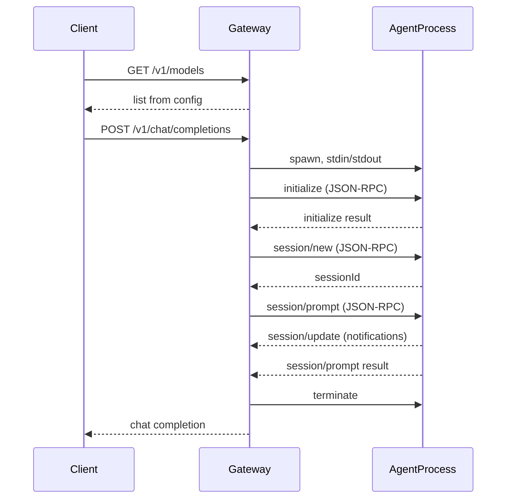

# ACP OpenAI API Gateway

OpenAI-compatible HTTP API that acts as a **gateway to the Agent Client Protocol (ACP)**. Clients use the usual OpenAI endpoints (`/v1/models`, `/v1/chat/completions`, `/v1/responses`); the gateway spawns ACP-compatible agents as subprocesses and talks to them over **stdio** (JSON-RPC), not HTTP.

## Problem

Many tools and SDKs expect an OpenAI-style API. ACP agents (e.g. [OpenCode](https://github.com/sst/opencode) via `opencode acp`) speak the [Agent Client Protocol](https://agentclientprotocol.com) over stdin/stdout. This gateway provides a single HTTP entry point: one base URL, OpenAI-shaped API, with an ACP agent run per request over stdio.

## How it works

1. **Config** – YAML and env define the agent command, env vars, optional list of model names, and working directory for sessions.
2. **No global ACP process** – The gateway does not start a long-lived ACP server or use HTTP to talk to the agent. ACP uses **stdio** only (JSON-RPC, newline-delimited).
3. **Per-request agent** – For each chat/responses request the gateway spawns one agent subprocess, performs ACP handshake (`initialize` -> `session/new` -> `session/prompt`), collects output from `session/update` notifications and the `session/prompt` response, then terminates the process.
4. **Translation** – OpenAI requests are converted to ACP JSON-RPC; ACP content (e.g. `session/update` agent_message_chunk) is converted back to OpenAI chat/responses format.
   - `GET /v1/models` – Returns list from config (no agent spawn).
   - `POST /v1/chat/completions` – One agent process, one turn, reply as chat completion.
   - `POST /v1/responses` – Same; optional `chat_id` for client-side continuity (each request still uses a new process).

See [docs/spec.md](docs/spec.md) and [docs/agent-client-protocol/docs/protocol/transports.mdx](docs/agent-client-protocol/docs/protocol/transports.mdx) for details.



## Quick setup

1. **Config** – Copy `config.example.yaml` to `config.yaml` and adjust. Every option can also be set via environment (see `.env.example`).

2. **Env** – Copy `.env.example` to `.env` and set values. All options (`CONFIG_PATH`, `ACP_*`, `GATEWAY_*`) can be configured via env.

3. **Run** – From the repo root:

```bash
pip install -r requirements.txt
CONFIG_PATH=config.yaml python -m gateway.main
```

Or with Docker Compose (reads `.env` and runs the `gateway` service):

```bash
cp .env.example .env
docker compose up --build gateway
```

4. **Use** – Point any OpenAI client at `http://localhost:8080/v1` (or your host/port). List models, call chat completions or responses; the gateway translates to ACP and back.

## Tests

Tests use a mock ACP over stdio (fake subprocess that responds with JSON-RPC). Route tests: `tests/test_models.py`, `tests/test_chat.py`, `tests/test_responses.py`, `tests/test_sessions.py`. Unit tests for mapping, errors, session_store, config, and stdio client in `tests/unit/`. Fixtures in `tests/conftest.py`.

From repo root:

```bash
pip install -r requirements-dev.txt
pytest tests/ -v
```

## Adding your own ACP in Docker

Build an image that includes the gateway and your ACP agent binary (e.g. `opencode acp`). Set `acp.command` and `acp.env` in config or `.env`. The gateway will spawn this command per request and talk over stdio. See [docs/deployment.md](docs/deployment.md).

## Specifications

- [docs/spec.md](docs/spec.md) – This gateway: OpenAI HTTP API to Agent Client Protocol (stdio).
- [OpenAI API OpenAPI spec](https://github.com/openai/openai-openapi/tree/manual_spec) – OpenAI REST API specification (OpenAPI).
- [Agent Client Protocol](https://agentclientprotocol.com) – Protocol for agent-client communication over stdio (JSON-RPC); see `docs/agent-client-protocol/`.

## License

This project is licensed under the MIT License, see the [LICENSE](LICENSE) file in the repository root for details.
