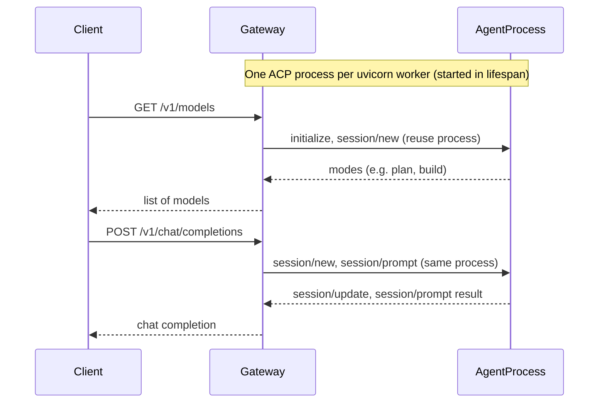

# ACPBox

OpenAI-compatible HTTP API that acts as a **gateway to the Agent Client Protocol (ACP)**. Clients use the usual OpenAI endpoints (`/v1/models`, `/v1/chat/completions`, `/v1/responses`); the gateway runs the API with **uvicorn** and keeps **one ACP agent process per worker** over **stdio** (JSON-RPC), not HTTP.

## Problem

Many tools and SDKs expect an OpenAI-style API. ACP agents (e.g. [OpenCode](https://github.com/sst/opencode) via `opencode acp`, or **Cursor Agent** via `agent acp`) speak the [Agent Client Protocol](https://agentclientprotocol.com) over stdin/stdout. This gateway provides a single HTTP entry point: one base URL, OpenAI-shaped API, with one ACP binary instance per uvicorn worker.

## How it works

1. **Config** – YAML and env define the agent command, env vars, and **workspace** (`ACPBOX_ACP_WORKSPACE`, default `./workspace`; Docker `/workspace`) passed as ACP `session/new` `cwd`.
2. **One ACP process per worker** – The app runs under **uvicorn**. In lifespan each worker starts **one** ACP agent subprocess and keeps it for the worker's lifetime. With 8 workers you get 8 ACP binary instances. ACP uses **stdio** only (JSON-RPC, newline-delimited).
3. **Reuse per request** – Each request in that worker uses the same process: `session/new` -> optional `session/set_mode` -> `session/prompt`, then the response is returned. The process is not terminated after each request.
4. **Translation** – OpenAI requests are converted to ACP JSON-RPC; ACP content (e.g. `session/update` agent_message_chunk) is converted back to OpenAI chat/responses format.
   - `GET /v1/models` – Uses the worker's ACP process: `initialize` (once) and `session/new`, returns **modes** (`modes.availableModes[].id`, e.g. OpenCode's `plan`, `build`) as the list of models.
   - `POST /v1/chat/completions` – Uses the worker's ACP process; `model` selects the ACP mode. Reply as chat completion, or **Server-Sent Events** when `"stream": true` (OpenAI-style `chat.completion.chunk` lines and `data: [DONE]`). With `stream: false`, optional **`acp`** is `{ "steps": [ reasoning + command summaries ] }` (no raw chunks). With `stream: true`, each chunk may still carry raw **`acp`** from the wire (see `docs/api-mapping.md`).
   - `POST /v1/responses` – Same; optional `chat_id` for client-side continuity (non-streaming only); **`acp.steps`** when present, like chat.

See [docs/spec.md](docs/spec.md) and [docs/agent-client-protocol/docs/protocol/transports.mdx](docs/agent-client-protocol/docs/protocol/transports.mdx) for details.



## Quick setup

### Install

The package is on [PyPI](https://pypi.org/project/acpbox/). That installs the **`acpbox`** CLI (uvicorn-driven server, see `pyproject.toml`).

**pipx** - isolated install, good for a long-lived CLI. You still need a **`config.yaml`** (copy [`config.example.yaml`](config.example.yaml) from this repo, or from [GitHub](https://github.com/EvilFreelancer/acpbox/blob/main/config.example.yaml)).

```bash
pipx install acpbox
acpbox --config ./config.yaml
```

Upgrade later with `pipx upgrade acpbox`. Try once without installing globally:

```bash
acpbox --config ./config.yaml
```

**pip**

```bash
pip install acpbox
acpbox --config ./config.yaml
```

**Git clone** - develop or pin to a revision.

```bash
git clone https://github.com/EvilFreelancer/acpbox
cd acpbox
cp config.example.yaml config.yaml
# edit config.yaml
pip install -e .
acpbox --config ./config.yaml
```

From a checkout without the console script, after `pip install -r requirements.txt`:

```bash
python -m acpbox.main --config ./config.yaml
```

1. **Config** – Copy `config.example.yaml` to `config.yaml` and adjust. Every option can also be set via environment (see `.env.example`).

2. **Env** – Copy `.env.example` to `.env` and set values. All options (`ACPBOX_CONFIG_PATH`, `ACPBOX_ACP_*`, `ACPBOX_GATEWAY_*`) can be configured via env.

   **Agent command (OpenCode vs Cursor)** – set `acp.command` in `config.yaml` or `ACPBOX_ACP_COMMAND` as a JSON array of strings.

   | Backend | `config.yaml` | Shell (env) |
   |---------|---------------|-------------|
   | OpenCode | `command: ["opencode", "acp"]` | `export ACPBOX_ACP_COMMAND='["opencode","acp"]'` |
   | Cursor Agent | `command: ["agent", "acp"]` | `export ACPBOX_ACP_COMMAND='["agent","acp"]'` |
   | Claude (ACP adapter) | `command: ["claude-agent-acp"]` | `export ACPBOX_ACP_COMMAND='["claude-agent-acp"]'` |
   | Codex (ACP adapter) | `command: ["codex-acp"]` | `export ACPBOX_ACP_COMMAND='["codex-acp"]'` |

   Use an absolute path if the binary is not on `PATH` (e.g. `["/home/you/.local/bin/agent","acp"]`). Cursor Agent must be installed and logged in (`agent login`) so the subprocess can reach your account.

3. **Run** – Start **`acpbox`** with **`ACPBOX_CONFIG_PATH`** (and other env vars) as needed. Use **`gateway.workers`** in YAML or **`ACPBOX_GATEWAY_WORKERS`** for worker count (one ACP subprocess per worker). **`ACPBOX_GATEWAY_THREADS`** is forwarded into **`uvicorn.run`** only if your uvicorn supports a `threads=` argument (many builds do not; ASGI uses **asyncio** per process).

Or with Docker Compose (reads `.env` and runs the **`acpbox`** service). Set **`AGENTS`** in `.env` to install missing agent binaries at container startup (comma-separated `opencode`, `cursor`, `claude`, `codex`). Runtime **`ACPBOX_ACP_COMMAND`** must match the installed binary (see Agent command table above). The image **CMD** is **`acpbox`** (uvicorn inside **`acpbox.main.run`**), with **`ACPBOX_GATEWAY_WORKERS`** and **`ACPBOX_GATEWAY_THREADS`** passed through the environment.

4. **Use** – Point any OpenAI client at `http://localhost:8080/v1` (or your host/port). List models, call chat completions or responses; the gateway translates to ACP and back.

## Tests

Tests use a mock ACP over stdio (fake subprocess that responds with JSON-RPC). Route tests: `tests/test_models.py`, `tests/test_chat.py`, `tests/test_responses.py`, `tests/test_sessions.py`. Unit tests for mapping, errors, session_store, config, and stdio client in `tests/unit/`. Fixtures in `tests/conftest.py`.

From repo root:

```bash
pip install -e ".[dev]"
pytest tests/ -v
```

## Adding your own ACP in Docker

Build an image that includes **acpbox** and your ACP agent binary (e.g. `opencode acp`). Set `acp.command` and `acp.env` in config or `.env`. The server runs with **uvicorn** via **`acpbox`**; each worker starts one ACP process in lifespan. To run 8 ACP instances, set **`ACPBOX_GATEWAY_WORKERS=8`** (or **`gateway.workers`** in YAML). See [docs/deployment.md](docs/deployment.md).

## Specifications

- [docs/spec.md](docs/spec.md) – This gateway: OpenAI HTTP API to Agent Client Protocol (stdio).
- [OpenAI API OpenAPI spec](https://github.com/openai/openai-openapi/tree/manual_spec) – OpenAI REST API specification (OpenAPI).
- [Agent Client Protocol](https://agentclientprotocol.com) – Protocol for agent-client communication over stdio (JSON-RPC); see `docs/agent-client-protocol/`.

## License

This project is licensed under the MIT License, see the [LICENSE](LICENSE) file in the repository root for details.
